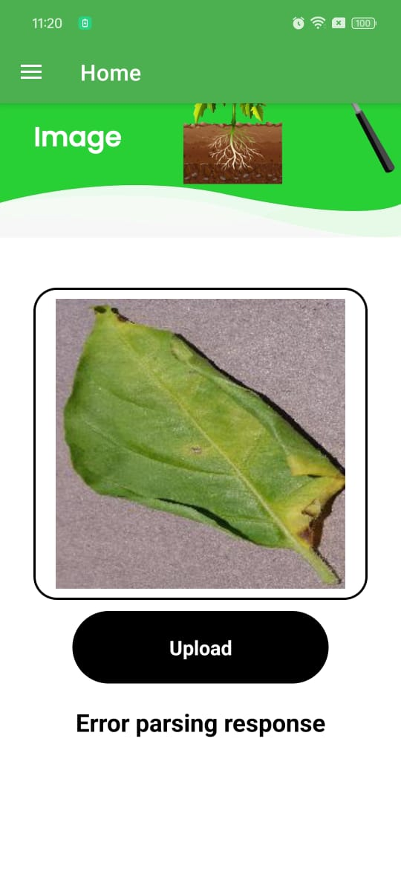
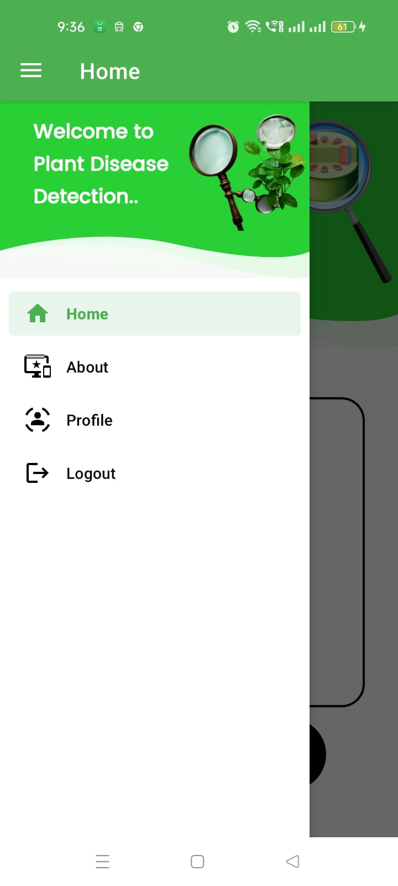
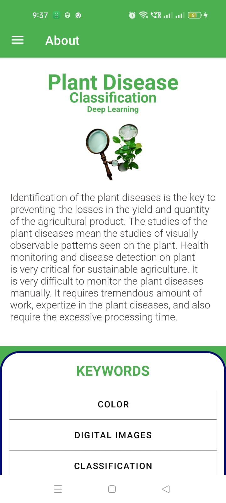
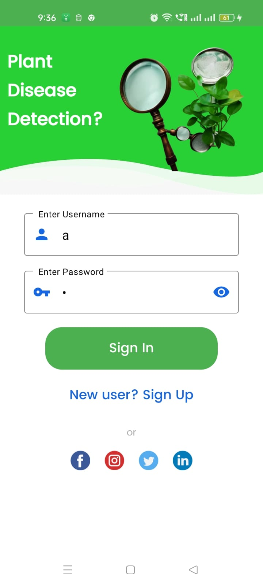
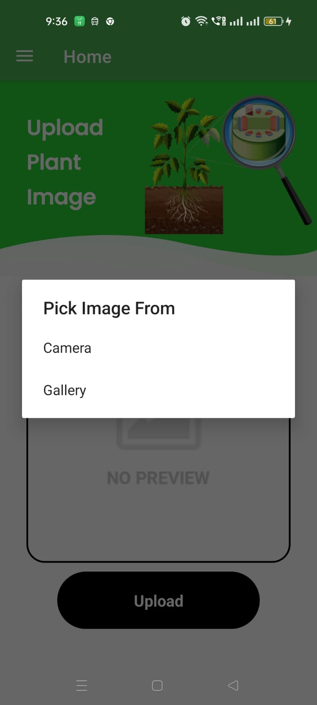
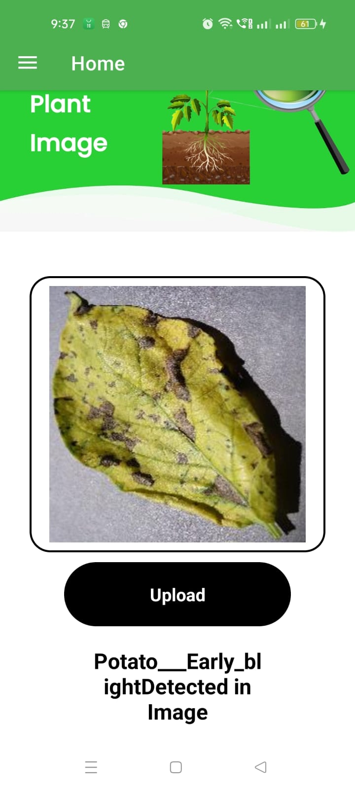

# 🌿 Plant Disease Classification App

This Android application detects plant diseases using deep learning models. Users can upload an image of a leaf, and the app will classify the disease using one of three pre-trained models: **InceptionV3**, **VGG19**, or **ResNet50**.

---

## 📱 Features

- Upload or capture leaf image
- Choose ML model for prediction:
  - InceptionV3
  - VGG19
  - ResNet50
- View predicted disease and confidence score
- Disease information (symptoms, treatments, etc.)
- User-friendly Android interface
- Flask backend for inference handling

---

## 🧠 Deep Learning Models

| Model       | Accuracy | Size     | Notes                         |
|-------------|----------|----------|-------------------------------|
| VGG19       | 89%      | Medium   | Simpler, fast on small data   |
| ResNet50    | 92%      | Medium   | Handles deeper layers well    |
| InceptionV3 | 94%      | Large    | Best performance overall      |

Trained on a dataset of healthy and diseased plant leaves.

---

## 🛠️ Tech Stack

| Layer      | Tech                                     |
|------------|------------------------------------------|
| Frontend   | Android (Java/XML or Flutter)            |
| Backend    | Python Flask                             |
| ML Models  | TensorFlow / Keras                       |
| Database   | (Optional) MySQL or Firebase for history |
| API Comm.  | Flask REST API + JSON responses          |

---

## 📂 Project Structure

## 📱 App Preview

